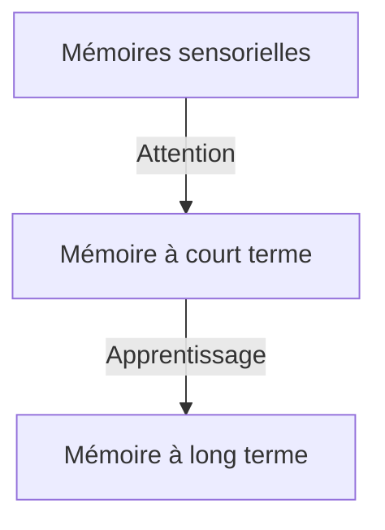

=> La mémoire joue un rôle important dans les apprentissage

Types de **neuromythes :**                       (mythes sur ce que l'on pense)
- Faits scientifiques du passé
- Simplification excessive
- Absence de sources

**Exemples :** (respectif)
-  ~~on a 3 cerveaux distincts et séparés 
- ~~nous n'utilisons que 10% de notre cerveau~~
- ~~nous avons un style d'apprentissage~~

=> TLM a une mémoire mais tout le monde ne sait pas s'en servir de façon optimale !

=> Notre mémoire a une capacité limitée :
> Expérience 1 : (noter de mémoire les séries)
> - 3 2 9 [V]
> - 5 0 3 8 [V]
> - 3 8 1 5 2 [V]
> - 9 1 2 5 1 8 [V]
> - 7 3 2 6 4 9 6 [V]
> - 6 1 8 3 6 3 9 5 [V]

> Expérience 2 : (noter une série de lettres de mémoire)
> - B Z T K [V]
> - D J R N Q P [V]
> - [XXXX] J'AI RIEN EU PTDRRR

Résultat des expériences : empan mnésique = 7 +/- 2 items
=> On est incapables de retenir plus => limite physique

> Expérience 3  : (noter une liste de mots dont on doit se rappeler)
> - livre maison chaise table grenouille soleil porte grêle chèvre pupitre 

Courbe en U pour (% dont on se souvient // position du mot) : on se souvient plus des mots au début et à la fin de la liste que de ceux au milieu
- Mots au début : primauté = fait de se souvenir des mots au début de la liste
- Mots à la fin : récence = fait de se souvenir des mots à la fin de la liste
=> Physiologique, cognitif, on ne peut pas mieux faire

Avec toutes ces infos, comment faire pour optimiser sa mémoire car mémoire immédiate saturée au bout de 7 informations :
- => prise de note essentielle
# Comprendre comment fonctionne notre mémoire pour mieux l'utiliser :

## Mémoires à court terme :
### La mémoire immédiate :
- mémoire à durée 
- capacité limitée 
- mémoire **passive** (information rentre et sort)
### La mémoire de travail :
- durée limitée
- très grande capacité
- trier et organiser l'information
- mémoire **active**
> **Expérience 4 :** Mémoire de travail (retranscrire une série de chiffre à l'envers)
> - 9 5 4 [V]
> - 4 0 1 8 [V]
> - 2 1 5 7 3 [21753 :/]
> - 8 5 4 0 2 [854902]

## Mémoires sensorielles
- **Mémoire visuelle**
- **Mémoire olfactive**
- **Mémoire auditive**
- **Mémoire gustative**
- **Mémoire somesthésique** (toucher, kinesthésie, etc.)
Ne dure que quelques secondes

Notre mémoire n'est pas une photo ! On ne se souvient que de l'ensemble.
On ne voit qu'un seul mot à la fois, pas l'ensemble

## Mémoire à long terme :
- durée illimitée
- capacité illimitée
Aucune preuve scientifique qui montre qu'il y a une limite

Elle se décompose en sous-catégories :
- Mémoire **épisodique** :
	- mémoire personnelle
	- mémoire du vécu
	- => fait notre individualité
- Mémoire **sémantique** :
	- mémoire de la connaissance générale
	- c'est ce que le système scolaire s'évertue à remplir
	- +/- commune 
	- Plus elle est riche, meilleures seront nos capacités d'apprentissage
- Mémoire **procédurale** :
	- Relève des procédures
	- Mémoire de nos automatismes, de nos habitudes
	- Ex: Savoir faire du vélo

=> Il y a dans cette mémoire une composante **automatique** (intuitif) et une composante **contrôlée** (raisonné)
=> Distinction entre **disponibilité** et **accessibilité** en mémoire à long terme : deux informations peuvent être disponibles en mémoire mais avec des degrés d'accessibilité différents
	**Exemple :**
	- Ce qu'on a mangé il y a trois jours (disponible, pas accessible)
	- Notre date de naissance (disponible, accessible
	Différence entre les deux : engramme (fragile // solide)

=> Elle de façon **associative** : plus on va créer d'associations, meilleur on sera, mais ces associations se créent toutes seules
	Pour bien apprendre, on commence par des choses faciles, et on construit là dessus
	Ce réseau associatif dépend de chacun

## Comment passer d'une mémoire à une autre
=> Systèmes de traitement de l'information 
=> Pour passer des mémoires sensorielles à la mémoire à court terme, on utilise l'**attention** 

3 systèmes **attentionnels** :
- L'**alerte** attentionnelles (vigilance) : __QUAND__ faire attention
- L'**orientation** attentionnelles : **A QUOI** faire attention
	Pour améliorer sa mémoire :
		- Eviter les distractions
		- On ne peut pas faire plusieurs choses en même temps : on n'est pas multi-tâche
- Le **contrôle exécutif** : **COMMENT** faire attention

=> Pour passer de la mémoire à court terme à la mémoire à long terme, j'**apprends**
Cerveau : 100 milliards de neurones connectés entre eux, 1 neuro ne = 10 000 connexion

> Quand on apprend, la structure du cerveau change.
> Des neurones se créent ou s'allongent pour se connecter à d'autres neurones
 Masson, 2017

=> **Plasticité cérébrale = neuroplasticité**
L'**apprentissage** repose sur cette neuroplasticité !

Apprentissage =
- Création de nouvelles connexions
- Renforcement de connexions existantes

L'apprentissage prends toutes les informations et en crée un engramme : une trace mnésique (marquage d'un réseau neuronal). Quand une situation similaire se crée, les informations reviennent en mémoire

Sauf que l'information se perd avec le temps, pour l'éviter, on peut :
- multiplier les sources d'informations : internet / notes / travail en groupe / livres
- faire des auto-tests, se rappeler ses cours, tester sa mémoire : renforcer sa trace

Pour maintenir un engramme, il faut faire de **l'apprentissage en profondeur**.
Mais qu'est-ce ?
=> Il faut donner du sens à ce que l'on apprend :
> **Expérience 5 :**
> Liste de mots,
> On demande à un groupe de savoir s'il y a une majuscule à un groupe et à un autre si c'est un animal
> Le groupe Maj en retient 30%, l'autre 80%

Sachant tout cela, comment optimiser notre mémoire ?

# À quoi sert la prise de notes ?
- l'empan mnésique = 7 +/- 2 items
- empêche de parler avec les voisins
- permet de ne pas dormir
- != copier sur son voisin car chacun a sa façon de prendre des notes qui correspond à ses mécanismes cognitifs personnels
	=> ne permet pas de réviser de manière optimale par la suite
- la prise de note personnelle permet d('apprendre son cours et de le réviser

## Méthodes pour être efficace :
=> Renforcer les traces mnésiques de la séance précédente 
On renforce à chaque fois qu'on essaye de se souvenir de ce q'on a fait la dernière fois
$\hookrightarrow$ Dès qu'on attend, on essaye de se souvenir ce qu'on a fait 