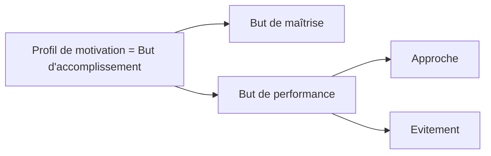
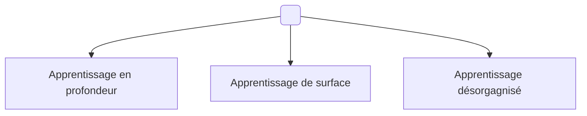

<iframe src="https://drive.google.com/file/d/1HLHLIf8-no0v1DIhhg1Mig7tNKcRYq8V/preview" width="640" height="480" allow="autoplay"></iframe>

**But de maîtrise =** Intérêt personnel à connaître les informations qu'on apprend
**But de performance =** Se comparer aux autres pour avancer
	- **Approche** : vouloir être meilleur que l'autre (mythe de l'élève brillant) = né brillant = pas besoin de travailler
	- **Evitement** : but de ne pas être le plus mauvais du groupe

But de maîtrise : 6 + 5 + 4 = 15
But de performance-approche : 15
But de performance-évitement : 14

**Plusieurs mindsets !**
Mais est-il possible de modifier un état d'esprit ? OUI
Nature, 2019 : Savoir qu'on est capable de changer de mindset améliore les performances | 1500 études sur 8 régions géographiques.
Ont mesuré les perfs des étudiants avant et après un cours de méthodologie : passe de 40% de notes satisfaisantes à +50% !
=> Le simple fait de savoir qu ele cerveau est malléable augmente les performances scolaires; marche très bien en maths et en sciences en général !

## **3 stratégies d'apprentissage :**

Inverser question 15 :
- Score : 6
Apprentissage en profondeur : [2, 7, 15, 20, 22] 25
Apprentissage de surface : [3, 8, 12, 18, 21] 19
Apprentissage désorganisé : [5, 10, 13, 17, 24] 25

Méthodes :
- interrogation elaborative : Pourquoi ?
- Auto-explication  : Comment ?
 => TD : Résolution de problème | Fonctionne car permet de faire de l'apprentissage en profondeur
 
 - Résumer avec ses propres mots
 - Surlignage : au max 15% du document
 - Mot-clés
 - Imagerie = cartes mentales / palais de la mémoire
 - Se relire
 - Auto-tests
 - Feuille blanche, s'imaginer les questions de l'exam, se projeter dans l'env° de l'exam, faire des exos autres que ceux déjà vus
 - Apprentissage distribué : ne pas travailler par bloc d'une matière mais bosser toutes les matières petit à petit ; au bout d'une semaine distribué = groupé ; au bout d'un mois, distribué = 2 $\times$groupé
	 => Diminue l'oubli

PLANIFIER SES PLANS DE REVISION : et s'imposer des tranches temporelles car Plus on a de temps, plus on en prend
Au delà d'un seuil de travail horaire, l'efficacité du temps passé décroît
